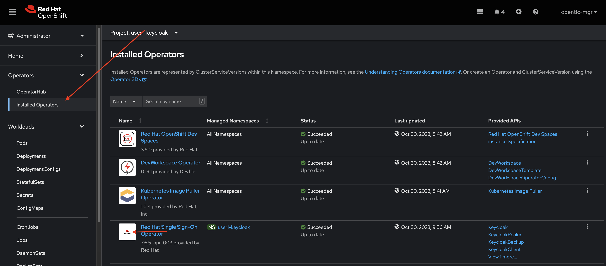
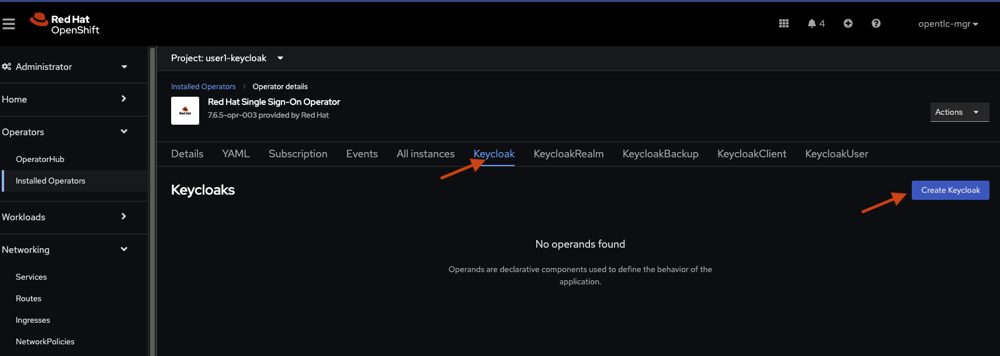

[#RH-SSO]
Red Hat Single Sign-On is an integrated sign-on solution available as a  containerized image. The Red Hat Single Sign-On for OpenShift image provides an authentication server for users to centrally log in, log out, register, and manage user accounts for web applications, mobile applications, and RESTful web services.

[#ocptemplates]
=== What are OpenShift Operators?

Red Hat® OpenShift® Operators automate the creation, configuration, and management of instances of Kubernetes-native applications. Operators provide automation at every level of the stack—from managing the parts that make up the platform all the way to applications that are provided as a managed service.

[#ssoinstall]
=== Installing RH-SSO on OpenShift
Make sure that you have completed the setting up instructions before moving forward in this section. 

Lets first take a look at the installed operators:

<1> Open the OpenShift console   {{ CONSOLE_URL }}[Open this link^] 

<2> Click on the button `Add` in the right menu and then > 'Developer Catalog' > 'All services'

<3> search for `SSO`

Using the OpenShift Console, look at the currently installed operators in your namespace and select the Red Hat Single Sign-On Operator

<1> Open the OpenShift console

<2> 'Operators' > 'Installed Operators'

<3> Make sure the project "userX-keycloak" is selected

<4> Click on the Red Hat Single Sign-On Operator

Install Red Hat SSO  by creating a Red Hat SSO resource using the "Keycloak" API Menu.

<1> Select the Keycloak type

<2> Click on the button `Create Keycloak` 

Examine the form, you can toggle between form view and yaml view to see configuration parameters. The operator offers many possibilities to customize the installation, but for this workshop, leave everything as default and click on the `create` button and the bottom of the page

image::sso-form.png[sso-form, 800]

Wait for the pods to come up.  You should see a database (default to postgres) and a keycloak-0 pods managed by a Kubernetes StatefulSet

<1> 'Workloads' > 'Pods'
<2> Wait for all the pods to be in Ready state 

image::sso-pods.png[sso-pods, 800]

Once compeleted, OpenShift will start the installation procedure and you can view the progress in the OpenShift console. Wait for the deployment to compelete. Once the deployment is finished. you should see the following on your OpenShift console. 

image::sso_installed.png[SSO installed]

Now that SSO is installed lets login to our newly created SSO. Click on the link as denoted in the picture and it should take you to the Red Hat SSO main page. 

image::sso_adminlogin.png[Login screen]

=== Let's move on
You now have a running SSO server. Lets move on to do some basic configuration before we head on to using it with our apps.

